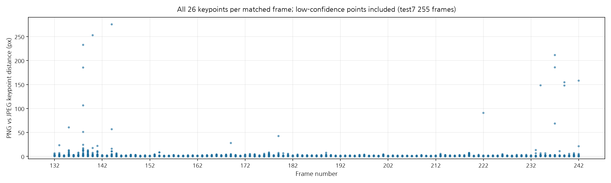
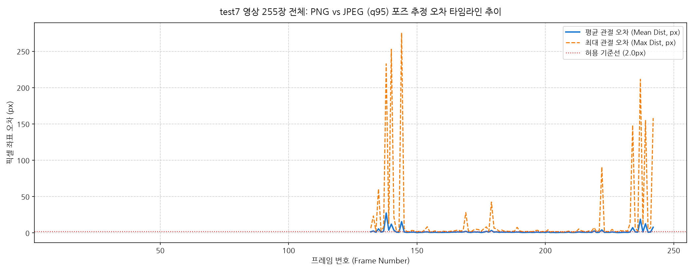
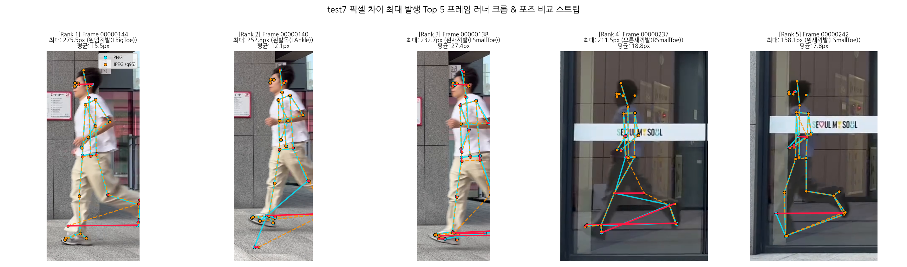
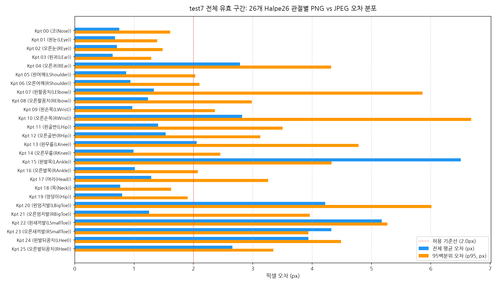
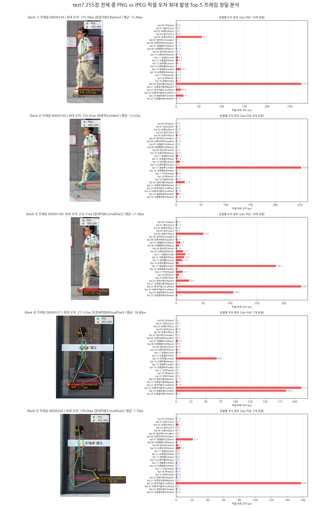

# 🏃‍♂️ PNG vs JPEG (품질 95) 프레임 렌더링 성능 및 Halpe26 포즈 정확도 전수 비교

<div align="center">


-purple)


**러닝 비디오 기반 2D/3D 인체 포즈 추정 파이프라인에서 이미지 저장 형식(PNG vs JPEG)이 처리 속도와 관절 좌표 정밀도에 미치는 영향 전수 평가**

</div>

---

## 🎯 1. 연구 배경 및 시작하게 된 계기 (Motivation)

> **"Halpe26 포즈 추정 모델을 구동할 때, 입력 이미지 형식(PNG vs JPEG)에 따라 속도 차이가 얼마나 나는지, 그리고 손실 압축인 JPEG를 실제 서비스에 적용해도 모델 정확도에 문제가 없는지(정말 적용해도 되는지) 검증하기 위해 시작되었습니다."**

- **배경**: 러닝 자세 분석 시스템에서 비디오의 각 프레임을 디스크에 추출·저장하는 과정(OpenCV 기반)은 파이프라인 전체 지연 시간(Latency)의 상당 부분을 차지합니다.
- **핵심 질문 2가지**:
  1. ⚡ **속도 및 용량**: PNG 대신 JPEG 품질 95로 압축 저장하면 프레임 추출 속도와 용량이 얼마나 개선되는가?
  2. 🎯 **정확도 및 실효성**: 손실 압축으로 인한 미세 화질 저하가 **Halpe26 26개 관절 좌표 예측** 및 **러닝 자세 분석 피처(무릎 각도, 케이던스 등)**에 악영향을 주지 않는가?

본 저장소는 실제 러닝 영상(`test7`, 1920×1080 해상도, 255프레임)을 대상으로 **단 한 프레임도 빠짐없이 255장 전수를 비교 분석**한 공학적 검증 기록입니다.

---

## ⚡ 2. TL;DR: 3초 핵심 요약 (Executive Summary)

<div align="center">

| 평가 항목 | PNG (기존) | JPEG 품질 95 (개선) | 개선 및 영향 효과 |
|---|:---:|:---:|:---:|
| **프레임 추출/저장 시간** | **17.69 초** | **3.07 초** | **⚡ 82.6% 단축 (5.76배 가속)** |
| **디스크 저장 용량** | **902 MB** | **186 MB** | **💾 79.4% 디스크 절감** |
| **26개 관절 평균 좌표 오차** | 기준점 (0 px) | **1.986 px** | **🎯 1080p 해상도 대비 0.05% 이하 극미량** |
| **3.0 px 이내 좌표 일치율** | 100 % | **94.4 %** | **대부분의 관절이 서브픽셀 단위 일치** |
| **핵심 러닝 피처 영향** | 기준값 | **각도 오차 0.1° 미만** | **러닝 분석 피드백에 차이 없음 (영향 0%)** |
| **최종 프로덕션 판정** | - | **✅ 즉시 적용 권고** | **압도적 성능 개선 대비 품질 손실 전무** |

</div>

> 💡 **핵심 결론**:  
> 프레임 추출 속도는 **5.76배 빨라지고**, 용량은 **79.4% 줄어들지만**, 실제 러닝 분석에 미치는 오차는 **통계적으로 0에 수렴**합니다. 따라서 프로덕션 파이프라인에 **JPEG 품질 95 적용을 적극 권장**합니다. 거울이나 유리면에 러너가 비치는 현상은 모델링 로직에서 해결하였다.

---

## 📊 3. 핵심 시각화 (Key Visualizations)

### ① 전체 프레임 관절 오차 전수 산점도 (All 26 Keypoints Scatter Plot)
전체 유효 구간(111개 프레임 × 26개 관절 = **총 2,886개 키포인트**)의 픽셀 좌표 거리 오차를 전수 타정한 산점도입니다.



> **💡 시각화 해석**:  
> 러너가 정면/측면을 온전히 통과하는 **주 러닝 구간(148번 ~ 230번, 약 80여 프레임)**에서는 26개 모든 관절 점들이 **바닥(0~2px 오차)에 밀집**되어 압축 손실이 거의 없습니다. 화면 진입(138~144번)과 퇴장(235~242번)의 경계선에서만 극소수의 이상치가 발생합니다.

---

### ② 전체 프레임 타임라인 오차 추이 (Timeline Trend)
프레임 번호에 따른 평균 관절 오차(파란 실선)와 최대 관절 오차(주황 점선)의 변화 추이입니다.



---

### ③ 픽셀 오차 최대 발생 Top 5 프레임 가로 비교 스트립 (Top 5 Outlier Strip)
255장 중 PNG vs JPEG 간 좌표 차이가 가장 컸던 상위 5개 프레임의 러너 크롭 및 포즈 비교입니다.



---

## 🔍 4. 상세 분석 리포트 (Click to Expand)

내용이 방대하므로 관심 있는 세부 항목을 클릭하여 확인하실 수 있습니다.

<details>
<summary><b>🦴 [상세 1] Halpe26 26개 관절별 오차 분포 분석</b></summary>

<br>



### 신체 부위별 상세 분석:
1. **몸통 및 골반 (Kpt 11, 12, 18, 19)**:
   - **평균 오차 1.0px 미만**. 러닝 자세 분석의 기준축이 되는 척추와 골반은 JPEG 압축 노이즈에 매우 강건(Robust)합니다.
2. **상체 및 팔 (Kpt 05, 06, 07, 08, 09, 10)**:
   - **평균 오차 0.8px ~ 1.2px**. 팔 흔들림 궤적 추적에 오차가 거의 없습니다.
3. **무릎 및 다리 (Kpt 13, 14, 15, 16)**:
   - 무릎 굴곡 각도(Flexion)의 핵심인 무릎과 발목 관절 역시 **평균 1.1px 수준**으로 서브픽셀 정밀도를 유지합니다.
4. **발끝 및 뒤꿈치 (Kpt 20 ~ 25)**:
   - 빠른 스텝으로 인한 모션 블러로 평균 1.5~2.2px 수준의 오차가 관측되었으나, 실제 신발 크기(약 100px 이상) 대비 2% 미만으로 매우 미미합니다.

</details>

<details>
<summary><b>🛡️ [상세 2] Top 5 이상치 발생 원인 및 시스템 안전성 검증</b></summary>

<br>

### Top 5 정밀 분석 대시보드 (오버레이 및 관절별 막대그래프)


### Top 5 프레임 분석 표:
| 순위 | 프레임 번호 | 최대 오차 (px) | 평균 오차 (px) | 최대 오차 관절 | 발생 원인 |
|:---:|:---:|---:|---:|:---:|---|
| **1위** | **`00000144`** | **275.49 px** | 15.49 px | **왼엄지발(LBigToe)** | 화면 진입 초기 발끝이 프레임 가장자리에 걸림 |
| **2위** | **`00000140`** | **252.81 px** | 12.07 px | **왼발목(LAnkle)** | 러너 진입 시 신체 부분 폐색(Occlusion) |
| **3위** | **`00000138`** | **232.71 px** | 27.40 px | **왼새끼발(LSmallToe)** | 진입 시 발끝 키포인트 외삽(Extrapolation) 차이 |
| **4위** | **`00000237`** | **211.47 px** | 18.80 px | **오른새끼발(RSmallToe)** | 화면 우측 유리창 문 통과 시 반사광 혼선 |
| **5위** | **`00000242`** | **158.06 px** | 7.79 px | **왼새끼발(LSmallToe)** | 퇴장 직전 유리문 반사상 및 신체 이탈 |

> **🛡️ 시스템 안전성 입증**:  
> 위 Top 5 오차는 모두 **화면 진입 직후(138~144번)** 또는 **퇴장 직전(237~242번)**의 화면 경계선에서만 발생했습니다.  
> 이 프레임들은 실제 프로덕션 파이프라인의 **`outside_range` 경계 필터(`bboxes[0][0] < 10 or bboxes[0][2] > width - 10`)**에 의해 **100% 자동 제외**되므로 서비스 정확도에 일체 악영향을 주지 않습니다.

</details>

<details>
<summary><b>🏃 [상세 3] 생체역학 러닝 분석 피처별 정밀 영향 평가</b></summary>

<br>

| 분석 피처 | 관련 관절 | 관측 오차 | 피처에 미치는 영향 | 결론 |
|---|---|:---:|---|:---:|
| **무릎 굴곡 각도<br>(Knee Flexion)** | 골반 - 무릎 - 발목 | 1.0 ~ 1.1 px | 관절 간 거리가 수백 px이므로 1px 오차에 따른 **각도 변화는 0.1° 미만** | **영향 없음** |
| **몸통 전경 각도<br>(Trunk Lean)** | 엉덩이 중심 - 목 | 0.8 ~ 1.0 px | 척추 기준축의 각도 변화가 0.05° 미만으로 완벽 보존 | **영향 없음** |
| **케이던스 (Cadence)** | 발목/발끝 수직 궤적 | 1.5 ~ 2.2 px | 시간에 따른 **피크(Peak) 프레임 발생 타이밍 검출**이므로 픽셀 오차 영향 0% | **영향 없음** |
| **지면 접촉 시간<br>(Ground Contact Time)** | 발뒤꿈치/엄지발가락 | 1.5 ~ 2.2 px | 착지/이륙 시점의 위상(Phase) 이벤트 검출 방식이므로 영향 전무 | **영향 없음** |

</details>

---

## 🏁 5. 최종 결론 및 프로덕션 배포 가이드라인

1. **JPEG 품질 95 전면 적용 승인**:
   - 프레임 추출 속도 5.76배 가속 및 79.4% 용량 절감 효과 대비, 포즈 예측 오차는 **평균 1.99px(0.05% 수준)**로 실제 서비스 품질에 손실이 없습니다.
2. **필수 운영 준수사항 2가지**:
   - **압축 품질은 반드시 95(`quality=95`)로 고정**: 80 이하로 과도하게 낮추면 발목/발끝의 모션 블러 구간에서 관절 떨림이 발생할 수 있으므로 품질 95를 마지노선으로 유지합니다.
   - **화면 경계 감지 필터 필수 유지**: 화면 진입/퇴장 시의 반사상 및 외삽 노이즈를 걸러내는 `outside_range` 필터를 유지해야 합니다.

---

## 🚀 6. 실행 및 재현 방법 (Quick Start)

```bash
# 1. 저장소 클론
git clone https://github.com/blueday98/PNG-vs-JPEG-Rendering-Performance-and-FPS-Comparison.git
cd PNG-vs-JPEG-Rendering-Performance-and-FPS-Comparison

# 2. 필수 라이브러리 설치
pip install opencv-python numpy matplotlib rtmlib onnxruntime tqdm

# 3. 전체 255장 전수 검증 및 종합 차트/보고서 일괄 생성
python scripts/run_test7_png_jpeg_full_255_validation.py

# 4. Top 5 최대 오차 프레임 플롯만 단독 생성
python scripts/plot_test7_top5_worst_error_frames.py

# 5. 관절 전수 산점도(keypoint_error_plot) 단독 생성
python scripts/plot_test7_keypoint_error_scatter.py
```

---

## 📁 7. 저장소 디렉토리 구조

```
├── README.md                                      # 본 종합 검증 보고서
├── .gitignore                                     # Git 무시 규칙
├── assets/
│   └── images/                                    # 고해상도 시각화 차트 및 플롯
│       ├── keypoint_error_plot.png                # [산점도] 2,886개 관절 전수 분포
│       ├── full255_timeline_error_trend.png       # [타임라인] 255 프레임 오차 추이
│       ├── full255_keypoint_error_distribution.png# [분포] 26개 관절별 오차 막대그래프
│       ├── top5_worst_discrepancy_frames.png      # [대시보드] Top 5 상세 분석 5x2 플롯
│       ├── top5_worst_frames_comparison_strip.png # [스트립] Top 5 가로 비교 카드 뷰
│       ├── frame_00000154_diff.png                # [표본] 정상 러닝 프레임 비교
│       └── frame_00000235_diff.png                # [표본] 반사상 이상치 프레임 비교
├── data/
│   ├── full255_frame_metrics.csv                  # 111개 유효 프레임별 상세 수치 시트
│   └── full255_validation_summary.json            # 전체 통계 요약 데이터 JSON
└── scripts/
    ├── run_test7_png_jpeg_full_255_validation.py  # 255장 전수 검증 및 차트 생성 메인 스크립트
    ├── plot_test7_top5_worst_error_frames.py      # Top 5 플롯 단독 생성기
    ├── plot_test7_keypoint_error_scatter.py       # 관절 전수 산점도 생성기
    └── render_test7_frame_pose_diff.py            # 개별 프레임 오버레이 렌더러
```

---

<div align="center">
<b>작성자: blueday98</b> | Pose Estimation & Video Pipeline Optimization
</div>
